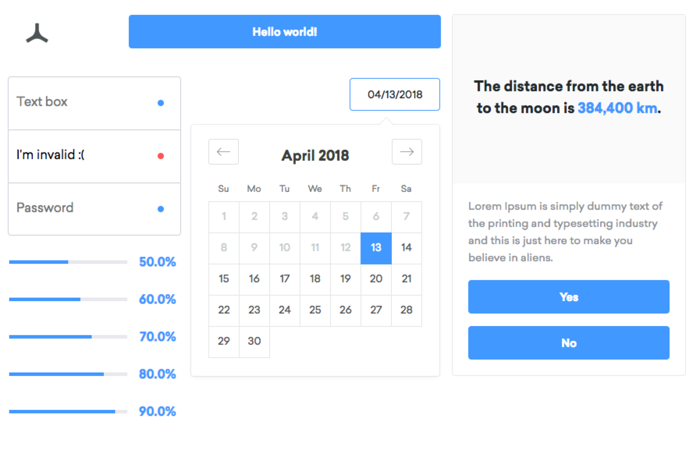

# Density UI

Density UI is a collection of Density-branded controls and styles for use in web projects.
<br />



## Quick-start development (using react-storybook)

```sh
npm i
npm start
```

## How it works

Each component has a number of different files:
- `index.js` contains the code to render the markup of a component in a react context. Its default
  export is the component.
- `story.js` contains a number of stories used to render the component in different states. Think
  of these like visual tests that one can quickly run through to determine if a component is
  working.
- `styles.module.scss` contains all styles required to render the ui component. This uses [css
  modules](https://github.com/css-modules/css-modules), which allows styles to be scoped to a given
  component.

## Styles

Styles are currently written in Sass, using [css
modules](https://github.com/css-modules/css-modules). In the css modules spec, classnames are by
convention in camelcase, which allows them to be imported into javascript and given to react nodes.
A basic example of this is below:

```scss
// styles.module.scss

.myCoolStyle {
  color: red;
}
```

```jsx
// component.js

import styles from './styles.module.scss';

const component = () => (
  <div className={styles.myCoolStyle}>Hello world!</div>
)
```

Because of how css modules work internally, the classname added to that div isn't actually
`myCoolStyle` - it actually (in a production environment) looks like this: `dui-fef83hw429fe`. There
are some pros and cons to this approach, but the biggest pro by far is that it's now impossible to
target elements by their associated `className` from outside the density ui context. And, it helps
to enforce the process of developing in the density ui repository, then publishing to npm and using
that package in a target project.

## Variables

Within a node (or bundler) context, the `require` function can be used to [import
json](https://stackoverflow.com/questions/7163061/is-there-a-require-for-json-in-node-js). However,
there's no way in vanilla Sass to do the same thing.

However, we were able to adapt [this plugin](https://github.com/Updater/node-sass-json-importer) to
let us solve this problem! At a high level, the plugin co-opts Sass's `@import` directive to work on
json files as well as sass and css. We've also added a couple handy features:

- Convert `camelCaseKeys` in json to `kabob-case-variables` inside of sass to match language
  conventions.
- If the value of a key is numeric, then the value is in units of pixels. Previously, numbers were
  brought into the styles as just raw numbers and this caused some issues.

# Writing a UI component
In general, try to follow these guidelines:

- Use stateless components. If that's going to be difficult for a particular component, then
  consider writing a stateless version that is wrapped by a stateful component, and exporting both.
  Especially with redux, ui components with internal state managed within themselves should be
  discouraged.

- Keep ui components as simple as possible and don't be afraid to break apart components into
  smaller, more composable components.


## Development build process
Density UI components are built to be developed within React Storybook. This environment can be
started with `npm start`, and manifests itself as a live reloading dev server that runs on port
`9009`. The webpack configuration for this can be found at `./.storybook/webpack.config.js`, and
this webpack configuration is used by react storybook.

A few particulars of this build environment:
- Css modules are set to use slightly more verbose class names to make debugging easier. For
  example, class names in this mode will look like `dui-styles-button-1SZwRzu8`.
- Babel is not explicitly used, since react storybook includes it separately to transpile jsx.
- Since the `css-loader` is used, webpack will build the styles associated with your component into
  the resulting javascript bundle. Therefore, you don't have to manage a separate css and javascript
  bundle, which is quite convenient.

## Deployment build process
The build webpack configuration file can be found in the root of this repository in `./webpack.config.js`. Once invoked, webpack does a number of things:

- New javascript features are transpiled down to es5 via `babel` and `@babel/preset-env`. Jsx is
  transpiled via `@babel/preset-jsx`. Async and await are transpiled into generators, which are then
  rewritten by babel to use [regenerator /
  regenerator-runtime](https://github.com/facebook/regenerator).
- Sass is compiled into css with node-sass, which is then fed into webpack's `css-loader`. This is
  configured to use terse classnames (ie, like `dui-2nr7dte5se8e`) and as a result produces a
  javascript module that applies the given css with the terse classnames when the bundle is
  executed.
- Finally, webpack bundles both css and javascript together into a single bundle, and wraps it in
  some code that extracts dependencies such as `react` and `prop-types` from the parent context to
  ensure that we are only using one version in the whole project.

Finally, this output bundle is placed in `dist/index.js` and the package is published with hts
`main` field in the `package.json` pointing to it.


# Publishing to NPM
To publish your changes to npm you need to bump the version number using `npm version`

```npm version (major|minor|patch)```


# Adding Density UI to a project
This is pretty easy.

1. Install a css reset:
Normalize.css is recommended:
```sh
npm i -S normalize.css
```

If using webpack, add `import 'normalize.css/normalize.css';`.
Otherwise, include `node_modules/normalize.css/normalize.css` in your css / sass


2. Install @density/ui
```
npm i -S @density/ui
```

Before the package can be used, you'll need to satisfy all of its peerdependencies by installing them.

3. Use a component:
```
// foo.js
import { Button } from '@density/ui';

// Use `Button`!
```
