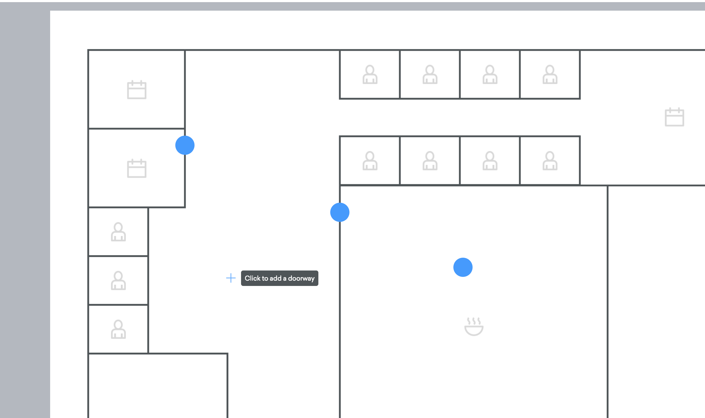

# Floorplan

This component can be used to render a floorplan, with optionally clickable shapes within it. The
floorplan can be panned and zoomed both on normal and touch devices. As an option, clicking on a
shape allows a popup to be shown around it and if a flag is set for it to be moved.

## Props
- `width: Number` - width of floorplan control in pixels
- `height: Number` - height of floorplan control in pixels
- `shapes: [Shape]` - an array of shapes to render on the floorplan. See below for a definition of
  `Shape`. *required*
- `image: String` - a url to an image that will be rendered as the floorplan's background image.
  *required*
- `cursorTagText: String` - Text to display in the cursor tag that is visible when no shape is
  selected. Defaults to `Click to add a doorway`.
- `onCreateShape: (Number, Number) => any` - Called when the user clicks the background of the
  floorplan without a shape selected, which typically would indicate a creation. The two arguments
  are the x and y position of the click relative to the top left hand corner of the floorplan image.
- `onShapeMovement: (String, Number, Number)` - A shape that has its `allowMovement` flag enabled
  has been moved. The first argument is the id of the shape, and the second two arguments are the x
  and y coordinates that the shape has been moved to. This function is expected to update the
  coordinates of the shape indicated by the first argument in the `shapes` prop in order for shape
  movement to work properly.
- `onShapeClick: (String) => any` - Called when a shape has been clicked. The id of the clicked
  shape is passed as the single argument to the callback.

### `Shape: Object`
- `id: String` - id of the shape.
- `shape: ReactElement` - "shape" to render on the floorplan. Passed the contents of this object in
  the `shape` prop along with a `selected` and `isMoving` flag, and expected to render a svg group
  representing the shape.
- `x: Number` - X coordinate of the shape.
- `y: Number` - Y coordinate of the shape.
- `width: Number` - Width of the shape, used to calculate the shape's center.
- `height: Number` - Height of the shape, used to calculate the shape's center.
- `allowMovement: Boolean` - can this shape be moved when selected/
- `popup: ReactElement` - a component to render in the popup that is rendered when a shape is
  selected.
