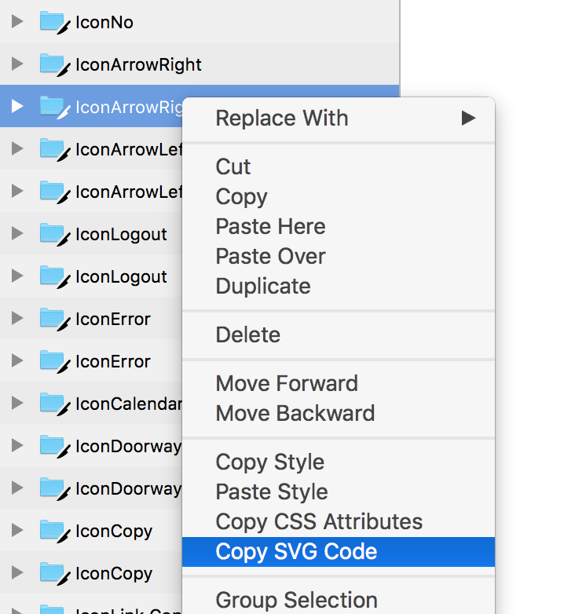

# Density UI Icons

> "Densicons"

## Usage

Install the ui package into whatever project you'd like:
```
npm install @density/ui
```

Use the icon:
```
import { Icons } from '@density/ui';

// In a react component:
<Icons.ImageUpload />

// With a special color
<Icons.ImageUpload color="primary" />
<Icons.ImageUpload color="#e59da1" />

// With a special size (in pixels)
<Icons.ImageUpload width={14} height={14} />
```

## Adding icons

## From sketch


1. Find [density-ui-icons](https://projects.plantapp.io/p/16938?r=1) on Plant.
2. In the sketch sidebar, right click on each icon and select Copy SVG Code.
3. Paste the resulting svg into the left pane of this tool: https://svg2jsx.herokuapp.com. Copy the output from the right pane.
4. Add the icon to the `ICONS` object in components/icons/index.js, where the key is the component
   name and the value is a function that accepts any props that can be passed to the component and
   returns the resulting jsx from the svg2jsx tool (parameterized with any props that would be
   desired)

Example of step 4:
```javascript
const ICONS = {
  /* ... */
  IconMyCrazyNewThing: ({color, width, height}) => <svg width={width || 18} height={height || 18}>...</svg>,
  /* ... */
};
```
